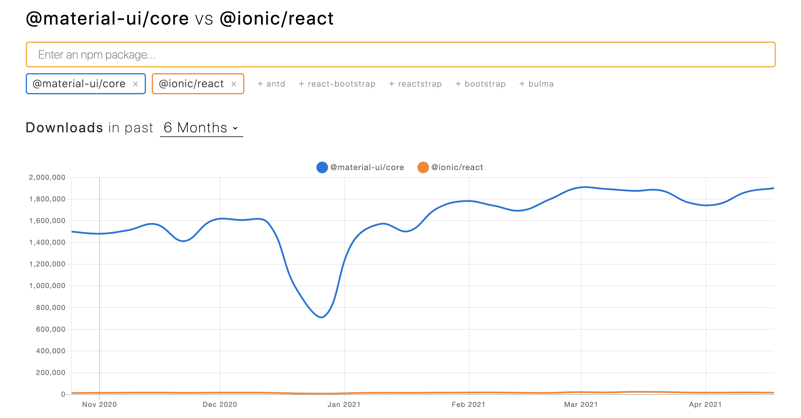

Плюсы MUI

- В компании имеется опыт работы с ним, с иоником работали немногие
- MUI написан на react, т е любой разработчик при необходимости может быстро понять исходный код. Ionic написан на stencil, опыта работы с которым ни у кого нет, поэтому в случае багов дебаггинг будет усложнен
- DX лучше чем у ionic: Материал предостовляет удобное решение для стилизации пирлжоения (useTheme), которое строго типизированно, и используется для всего приложения (JSS), т е создавать кастомные компоненты очень удобно. В ионике придется докручивать решение: css modules, css-in-js, etc, что приведет к некосистетной кодовой базе среди проектов компании
- MUI сильно популярнее ионика (нпм скрин снизу), github: 68k - MUI (только реакт), 43k - Ionic (все 4 платформы)

Минусы MUI
- Нету встроенного решения для формирования страниц, например IonicPage, IonicContent

  

Плюсы ionic

- Из коробки есть решение для роутинга (обертка над react-router с анимациями имитирующие натив, но с бедной документацией), pull-to-refresh, virtual-list
- Позиционирует себя как mobile-first

Минусы ionic

- Много нестандартных вещей CustomEvents, onIonChange и тд, что может негативно повлиять на интеграцию с react-библеотиками
- Начал делать роутинг, сделал вложенные роуты для инкапсулации модулей и сразу напоролся на баг https://forum.ionicframework.com/t/ionic-react-nested-routes/194055, который висит с августа
- Маленькое реакт коммунити, сильно проигрывает MUI по npm трендам
- Довольно слабые опции для кастомизации (цсс переменные для цветов и паддингов)

IMHO: Лучше выбрать material-ui, и допиливать недостоующие части самостоятельно или выбрать библеотки для основных проблем из зашить в npm пакет

## Routing

Минусы декларативаного/урл роутинга

### Потеря внутреннего стейта экрана в сложных флоу

Т к флоу с большим количество шагов популярный паттерн в наших проложениях, при использовании декалративного роутинга стандартный стейт реакта будет терятся.
Такие вещи как: значения форм, визульный стейт, при использовании решений реакта useState или форм с useForm (RHF) из коробки будут терятся, т к коопненты будет польностью выгружен. При испльзовании декларативного роутинга придется искать решение для сохранения всех стейтов снаружи реакта (state manager, url state, etc..)

### Превентирование перехода назад/выхода из флоу

В стандартном урл роутинге если юзер нажмет назад (например на android back button) из коробки есть только одно решение для этой проблемы - использование браузерного prompt(стандартная блокирующая операция), т к это системное окно, стилизовать его не предоставляется возможным, также если у нас в дизайне будут окна одного вида, они будут отличаться от нативной модалки. И мы сможет пробросить только сообщение, никаких иконок кастомных действий и тд

see: https://reactrouter.com/core/api/Prompt

### Сложность моделирования длинных/динамических флоу

### Браузерная история и УИ в разных потоках

### Вычищение некоторых экрано из сложных флоу

Например, у нас есть флоу перевода: ask recipient -> ask amount -> confirm -> result details
И когда юзер проходит до шага `details` мы хотим вычичистить все предыдущии шаги из истории, так например если юзер нажмет `назад` (android back) мы должны будем бросить его сразу на главный экран. Однако, на ios есть свайп бэк, и при свайпе юзер быдет видеть предыдущие шаги, но если он дотянет свайп и произойдет навигация, экран подменится на главный, что будет выглядеть багованно
